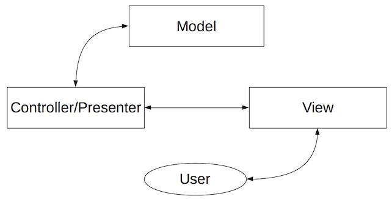
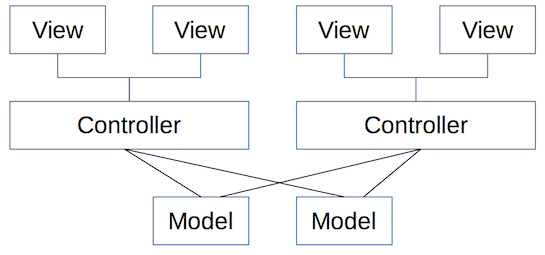
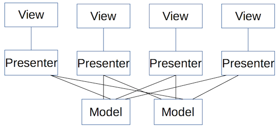

# Write your own Android MVP library

With all the MVP hype lately lets talk about what it is and how we can create our very own library perfect for your requirements and this with only 2 classes and an interface.

Because everyone or every team has a specific preferences or setup I recommend developing your own MVP implementation. Code it to your own liking or adjust it to the needs of your own project or team. Writing your own implementation will seem like a lot of work, or time consuming. But it really isn't, and you'll really know what is happening instead of relying on someone else his library without knowing what is going down under the hood.

## What is MVC/MVP & why would you use it.

* All implementations vary a little bit, all have pros and cons. In some situations there might be a reason to go against some design patterns, an example below.

* Some people may be more familiar with the term MVC from other languages. There is a small difference between MVP and MVC but more about that below. Let's analyze the different components and how they interact.



* Model: The model or dataObject model is an abstract model that organizes elements of dataObject. The model doesn’t know anything about views and controllers.
* Controller: The controller is the decision maker and the glue between the model and view. The controller updates the view when the model changes.
* View: The view is what's presented to the users and how users interact with the app.

#### Controller versus Presenter
* From the above explanation it is clear that both are the middle man between the model and the view.



* So let's analyze what happens here. As you can see the controller does three things.
    1. A controller can be in control of multiple views, and thus is responsible for which view to display.
    2. The controller is the middle man between communication between the views and the model.
    3. The controller takes care of logic.



* As you can see the presenter does almost the same things but there is one key difference, and this will clarify why I prefer Presenter over Controller in Android. The controller is/may be responsible for which view to display. So one controller can map to more Views. A presenter does not have this responsibility, a presenter maps one on one with the view. Why this is important is explained below.


#### Why would you use it?
* It allows for a loosely coupled system. Loosely coupled systems have tons of benefits but is out of the scope of this article, here are some benefits to give you an idea why you'll love this in your code.
    * Allow simultaneous work between developers who are responsible for different components (such as UI layer and core logic). In most cases the model is defined at the start of the project, once the model is know you can define a contract between the view and controller. Now the developers know how to communication between the controller and view is defined and thus don't need to know how it is implemented.
    * Separation of view logic from business logic. Allowing for interchangeable components and implementations.

## How does this translate to Android?

* As might be clear MVP is better suited for Android. A good reason for this is keeping the Presenter android package free, makes it perfect for interchanging it with other Java projects. And making it easier to be unit tested.
* Let's say we'd use a controller. We would have to give it a reference to the activity context in order to switch to a different activity. Now on a switch of activity we'd need to replace the old context reference to the new activities context references. Writing that already felt like a hassle. So let's avoid that.

* Presenter: Holds our business logic, handles dataObject retrieval,
* View: Our view is responsible for visualizing the dataObject to the user

## Basic example

There is a couple of decisions we need to make. This are the ones I prefer and will demonstrate/explain in this article.
    * The Presenter is lifecycle free.
    * Do not retain the presenter over config change.
    * Presenter Android package free

#### The contract
* First let's create the contract between the View and the Presenter.

```java
public interface MVPContract {
    interface MainView {
       void showData(Data dataObject);
    }
    interface MainPresenter {
        void getData();
        void attachView(MainView view);
        void detachView();
    }
}
```

* View: In our basic example we want our View to show some `Data`.
* Presenter: We want our Presenter to do several things.
    * Retrieve dataObject from somewhere
    * Attach the View
    * Detach the View

#### View implementation (Activity)
* The activity is our View and thus it implements MainView.
* Creating our Presenter
    1. We must create our Presenter in our View so in `onCreate` we'll create our Presenter. `presenter = new MainPresenter();`
    2. Our must Presenter must have a reference to our View so we'll attach the view `presenter.attachView(this)`.
    3. From this point on we have a Presenter and can rely on it for logic.
    4. In `onDestroy()` we'll detach ourself since we won't exist anymore after this point.
* Using the presenter since we now have a Presenter we can use it to do for us what was defined in the contract. So let's call `presenter.getData()`, we are not interested in waiting until it returns. It will notify us when the View needs to show something.
* Implement the contract methods

#### Presenter implementation
The Presenter is pretty straight forward if you're familiar with Java.
* A constructor
* Implement attachView/detachView, respectively store and clear the reference to the View.
* Implement the contract methods.

## Abstract the code and make a library

* It's not really a library yet, is it? So let's abstract it a little more and let's create something we can add to every project we want to MVPorize.

#### View

* Our View is our Activity, so let's analyze what happens here.
`public class MainActivity extends AppCompatActivity implements MVPContract.MainView {`
1. We implement our `MVPContract.MainView` to ensure our MPV View upholds its contract.
2. The activity holds a reference to the `Presenter`
3. Create the `Presenter` in `onCreate` and attach ourself to it.
4. In `onDestroy` we detach ourself.

* This is the minimum functionality we want for every View, so if we abstract that we need a `BaseMVPContract` with a `BaseMvpView` and an abstract class `BaseMvpActivity` we extend from.
* Our `BaseMvpView` doesn't require any initial functionality so it becomes an empty interface.

```java
public interface BaseMVPContract {
    interface BaseMvpView {}
}
```

* The `BaseMvpActivity` needs to hold a reference to the `Presenter` and a way to create that `Presenter`. In order to know what type the `Presenter` is, let's ask for it with generics.

```java
public abstract class BaseMvpActivity<P extends BaseMVPContract.BasePresenter> extends AppCompatActivity implements BaseMVPContract.BaseMvpView {

    protected P presenter;

    protected abstract @NonNull P createPresenter();
```

* Now we have our `Presenter` and a way to create it so lets do so in `onCreate`.

```java
@Override
    protected void onCreate(@Nullable final Bundle savedState) {
        super.onCreate(savedState);
        presenter = createPresenter();
        //noinspection unchecked
        presenter.attachView(this);
    }
```

**Beware!!! Since we don't know what actual type our View is yet, and neither does our `Presenter` we will have to cast our `BaseMvpView` to the actual type. Purposely mismatching the View will cause an `ClassCastException`. //noinspection unchecked`**

* We need to do one more thing and that is detach ourself in `onDestroy`

```java
@Override
protected void onDestroy() {
    super.onDestroy();
    presenter.detachView();
}
```

#### Presenter

* Our `Presenter` as you can see from our previous written code needs some base functionality. It needs functionality to attach **a** `BaseMvpView` and detach it. Let's translate this to our `BaseMvpContract`.
* In order to know **what** `BaseMvpView` we need to attach, we'll ask for the type with generics.

```java
public interface BaseMVPContract {
    interface BaseMvpView {}

    interface BasePresenter<V extends BaseMvpView> {
        void attachView(V view);
        void detachView();
    }
}
```

* Now we either have to implement that in every `Presenter` or we can define the base functionality in an abstract class... So let's do that.
* This is where you define the minimal requirements for your `Presenter`. We want a reference to `V` in order to communicate to our `BaseMvpView` through our contract. And we need to define functionality to attach and detach our `BaseMvpView`.

```java
public abstract class BasePresenter<V extends BaseMVPContract.BaseMvpView> implements BaseMVPContract.BasePresenter<V> {

    protected V view;

    @Override
    public void attachView(V view) {
        this.view = view;
    }

    @Override
    public void detachView() {
        view = null;
    }
}
```

**In lib-example you can find a master-detail example of how to use your newly written library.**

## Highly customizable and your own responsibility

Some of us prefer the idea of being in control of our architecture. Because you wrote it yourself, if something goes wrong no-one else is to blame but more importantly because you wrote it yourself you know exactly what is going on and in my eyes it's less error prone. Every library has a learning curve because you don't know the code base, nor do you know all the functionality unless you spend time getting familiar with all of it.